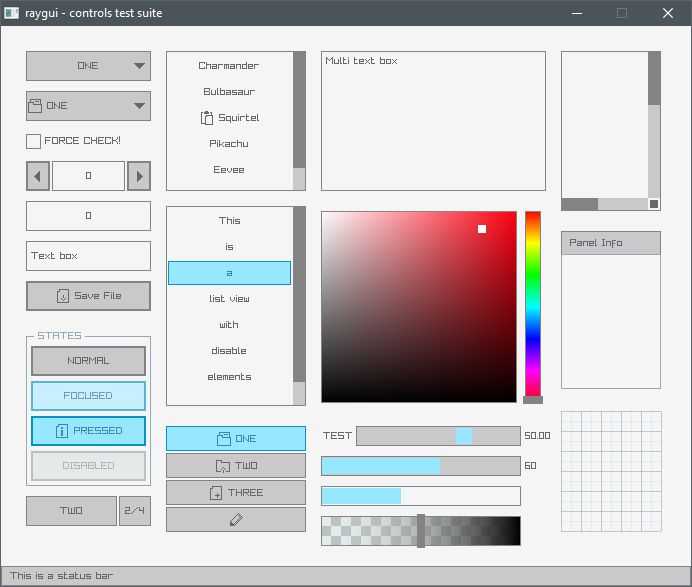

# Test examples for raylib and raygu  

Using:
* GCC 9.2.0 - https://github.com/raysan5/raylib/releases/tag/4.2.0 (Some examples are updated from the current repo) (static)
* FreeBASIC 1.09.0 - https://github.com/WIITD/raylib-freebasic (shared)
* Python 3.10.6 - https://github.com/electronstudio/raylib-python-cffi/releases/tag/v4.2.1.2 (pyray)

Examples have been tested on Windows 10 and Lubuntu 20.04 LTS  

## Preview images  

shapes_basic_shapes  
  

controls_test_suite  
  
