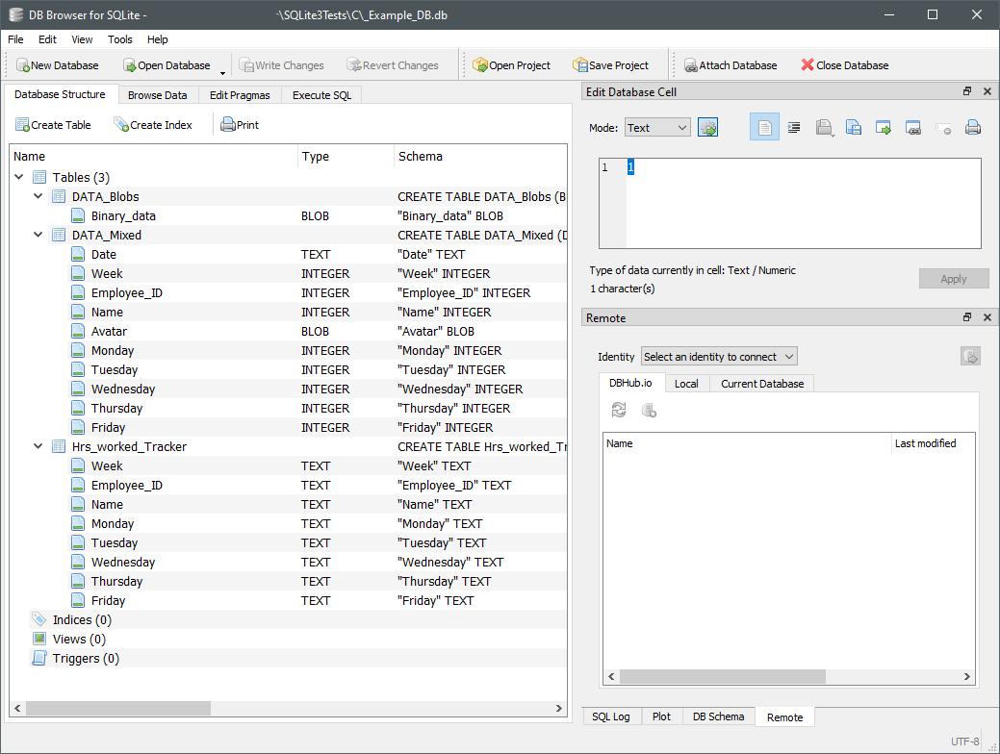
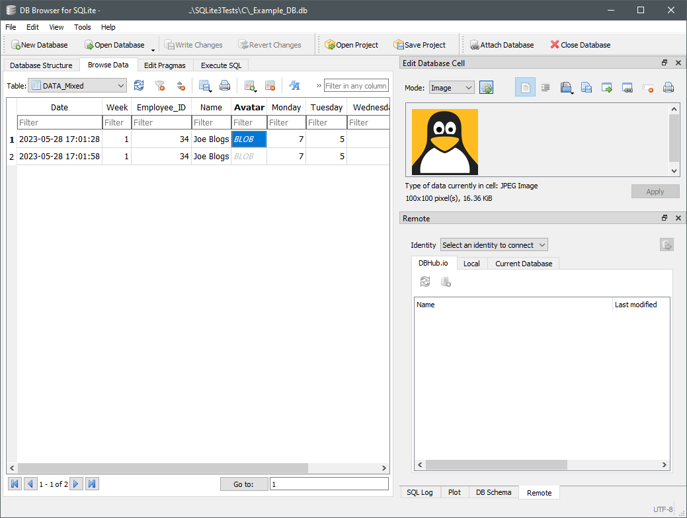

# C Sqlite 3 wrapper functions and Examples
  
This is a collection of C warapper functions and examples to illustrate methods of interacting with the SQLite 3 .dll/.so.  
  
***
Requires Sqlite3.dll (Version 3.34.1 dll.so) in the path or project directory. Tested on Windows 10 x85-64 and Ubuntu 20.04 x86-64.  
## Windows:  
https://www.sqlite.org/2021/sqlite-amalgamation-3340100.zip  
https://www.sqlite.org/2021/sqlite-dll-win64-x64-3340100.zip  
https://www.sqlite.org/2021/sqlite-doc-3340100.zip  
https://www.sqlite.org/2021/sqlite-tools-win32-x86-3340100.zip  

## Ubuntu:  
sudo apt update  
sudo apt install libsqlite3-dev  
/usr/lib/x86_64-linux-gnu/libsqlite3.so  
***
  
There are 2 C source modules in this repo and are organised as follows:  

* **example_calls.c**  
	A collection of basic examples that interact with the SQLite in a number of different ways. This set of examples makes use of a collection of wrapper functions contained in "example_sql3.c". Both "example_calls.c" and "example_sql3.c" are just examples and convenience wrappers to highlight some of the common methods as well as some of the different ways of interacting with the SQLite library.  
	The example SQLite transactions do not make up a functional application. You will need to un-comment or comment out sections as required to create, write or read from a database file or table.  
* **example_sql3.c**  
	A collection of convenience wrapper functions to illustrate some of the methods of interacting with SQLite 3. The main goal of these functions are to highlight the common sqlite3_prepare_(), sqlite3_step and sqlite3_finalize function set. These 3 SQLite API calls make up the common group of routines used in an SQLite 3 query.  
	The sqlite3_open and sqlite3_close API calls are used at the beginning and end of each wrapper function as a convenience to make each function stand alone. In practice we may only need to open the database file once in main() at the beginning of our application and close the database after all transactions have been completed. Although this looks like a lot of code, in an actual database application only a small fraction of the example code is required.  
	Use the wrapper functions as a guide for different tasks and methods from which you can practice designing your own database application. Some methods are shared between example_calls.c and example_sql3.c.  
  
Example_DB.db is an example of the correct database entries from the examples.  
Tux.jpg is a small icon used for BLOB entries in the examples.  
***
 
As well as the examples provided here I would also recommend obtaining a copy of a database management application to check your entries and queries for accuracy or errors in your code. Although SQLite does provide helpful return and error codes, the inside of the database file can be quite opaque from a programmatic perspective. Use the database management application along side of your IDE to monitor the database.  
If you are considering storing BLOBS in your database I would also recommend being familiar with a Hex Editor application as well as something like Notepad++. Byte lengths and actual bytes stored and returned must be checked for length and compared with the original data. A hex editor will allow you to format hex data from python as well as the database file. Notepad++ will allow an easy diff compare as well as total bytes compare between formatted hexadecimal.  
  
I am using the portable version of "DB Browser for SQLite"  
https://sqlitebrowser.org/dl/ for database management.  
And HXD for checking binary (Hex) entries  
https://mh-nexus.de/en/hxd/

***  
   
## Preview images  
  
Example_Tables  
  
  
Example_Data
  
  
Axle
